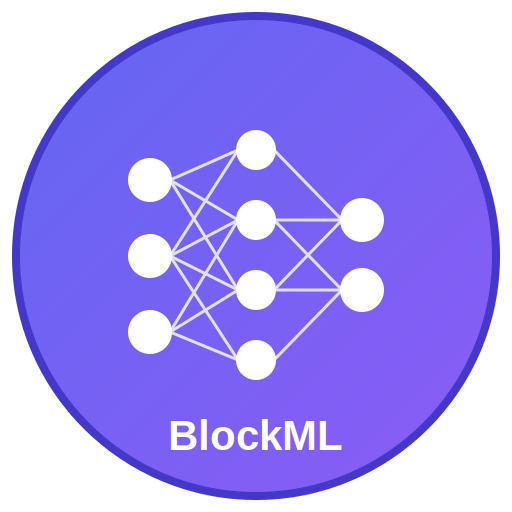

# 🖥️ BlockML Desktop - Neural Network Builder & Training Application

BlockML Desktop is a powerful, native desktop application for building, training, and deploying neural networks using a visual drag-and-drop interface. No more browser limitations - enjoy the full power of your machine for AI development!



## 🚀 Features

### 🎨 **Visual Neural Network Design**
- **Drag & Drop Interface**: Build complex neural networks by dragging components
- **Real-time Validation**: Instant feedback on model architecture and connections
- **Component Library**: Pre-built layers, activations, and utilities
- **Template System**: Quick-start templates for common architectures

### 🧠 **Real Neural Network Training**
- **Actual Computation**: Real forward/backward propagation with weight updates
- **Multiple Optimizers**: Adam, SGD with configurable parameters
- **Loss Functions**: Cross-entropy, MSE, and more
- **Live Metrics**: Real-time loss, accuracy, and training progress
- **GPU Acceleration**: WebGPU support with CPU fallback

### 💾 **Desktop Integration**
- **Native Performance**: Full system resource utilization
- **File System Access**: Save/load projects locally
- **Keyboard Shortcuts**: Professional workflow shortcuts
- **Menu Integration**: Native OS menus and dialogs
- **Auto-Updates**: Automatic application updates (future)

## 📦 Installation

### Download Pre-built Binaries
1. Go to [Releases](https://github.com/blockml/desktop/releases)
2. Download for your platform:
   - **Windows**: `BlockML-Setup-1.0.0.exe`
   - **macOS**: `BlockML-1.0.0.dmg`
   - **Linux**: `BlockML-1.0.0.AppImage` or `.deb`
3. Install and run!

### Build from Source

#### Prerequisites
- Node.js 16+ 
- npm or pnpm
- Git

#### Steps
```bash
# Clone the repository
git clone https://github.com/blockml/desktop.git
cd blockml-desktop

# Install dependencies
npm install

# Development mode
npm run electron-dev

# Build for production
npm run dist
```

## 🎮 Quick Start

### 1. **Launch BlockML**
- Double-click the desktop icon
- Or run from command line: `npm run electron-dev`

### 2. **Create Your First Model**
1. **Quick Start**: Click "Simple Classifier" in the Block Library
2. **Manual**: Drag components from the library to build custom architectures
3. **Connect**: Click and drag between component ports to create connections

### 3. **Configure Training**
1. Click the "Training" tab in the right panel
2. Set parameters:
   - **Epochs**: 10-50 (start with 10)
   - **Learning Rate**: 0.001
   - **Batch Size**: 32
   - **Optimizer**: Adam

### 4. **Train Your Model**
1. Click "Train" in the toolbar
2. Watch real-time metrics
3. Observe loss decreasing and accuracy improving

### 5. **Save Your Work**
- **Ctrl+S** (Cmd+S on Mac) to save projects
- **Ctrl+E** to export trained models

## 🔧 Development

### Project Structure
```
blockml-desktop/
├── app/                    # Next.js app directory
├── components/             # React components
├── lib/                    # Core libraries
│   ├── webgpu-runtime.ts   # Neural network engine
│   ├── tensor-validation.ts # Graph validation
│   └── store.ts            # State management
├── public/                 # Static assets
│   ├── electron.js         # Electron main process
│   └── icon.*              # Application icons
├── styles/                 # CSS styles
└── dist/                   # Built applications
```

### Available Scripts

```bash
# Development
npm run electron-dev        # Start in development mode
npm run dev                 # Next.js development server only

# Building
npm run build              # Build Next.js app
npm run electron-pack      # Build Electron app
npm run dist               # Build for current platform
npm run dist-all           # Build for all platforms

# Utilities
npm run lint               # Run ESLint
npm start                  # Start production Next.js server
```

### Development Mode
```bash
npm run electron-dev
```
This starts:
1. Next.js development server on `http://localhost:3000`
2. Electron app that loads the dev server
3. Hot reloading for both React and Electron

## 📱 Platform Support

| Platform | Status | Formats |
|----------|--------|---------|
| **Windows** | ✅ Supported | `.exe`, `.msi` |
| **macOS** | ✅ Supported | `.dmg`, `.pkg` |
| **Linux** | ✅ Supported | `.AppImage`, `.deb`, `.rpm` |

### System Requirements
- **RAM**: 4GB minimum, 8GB recommended
- **Storage**: 500MB available space
- **CPU**: Modern 64-bit processor
- **GPU**: Optional (WebGPU compatible for acceleration)

## 🎯 Key Features Comparison

| Feature | Web Version | Desktop Version |
|---------|-------------|-----------------|
| **Performance** | Browser limited | Full system resources |
| **File Access** | Download/Upload | Native file system |
| **GPU Access** | WebGPU only | WebGPU + Native APIs |
| **Offline Usage** | ❌ | ✅ |
| **Auto-save** | LocalStorage | File system |
| **Integration** | Browser only | OS integration |
| **Memory Limits** | Browser limits | System limits |

## 🔒 Security & Privacy

- **Local Processing**: All training happens on your machine
- **No Data Upload**: Your models never leave your computer
- **Open Source**: Full transparency in code
- **Sandboxed**: Electron security best practices
- **Auto-updates**: Cryptographically signed updates

## 🛠️ Troubleshooting

### Common Issues

**App won't start**
```bash
# Clear cache and reinstall
rm -rf node_modules package-lock.json
npm install
npm run electron-dev
```

**Training not working**
- Ensure model has valid connections
- Check console for validation errors
- Try simpler architectures first

**Performance issues**
- Close other applications
- Check available RAM
- Enable GPU acceleration in settings

**Build failures**
```bash
# Install platform-specific dependencies
npm run postinstall
# Clean build
rm -rf dist out .next
npm run dist
```

## 🔄 Updates

The desktop app includes auto-update functionality:
- **Automatic**: Updates download and install automatically
- **Manual**: Check "Help > Check for Updates"
- **Beta Channel**: Enable in preferences for early features

## 🤝 Contributing

We welcome contributions! See [CONTRIBUTING.md](CONTRIBUTING.md) for guidelines.

### Development Setup
1. Fork the repository
2. Create feature branch: `git checkout -b feature-name`
3. Make changes and test
4. Submit pull request

### Reporting Issues
- Use GitHub Issues for bugs and feature requests
- Include system info and reproduction steps
- Attach logs from Help > Show Logs

## 📄 License

MIT License - see [LICENSE](LICENSE) for details.

## 🙏 Acknowledgments

- **Electron** - Cross-platform desktop framework
- **Next.js** - React framework
- **Radix UI** - Component library
- **Tailwind CSS** - Styling framework
- **Contributors** - Everyone who helped build this!

---

**Ready to build the future of AI?** 🚀  
[Download BlockML Desktop](https://github.com/blockml/desktop/releases) and start creating neural networks visually!
